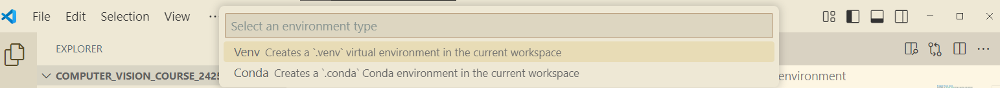

# Computer Vision Course
Developed by [Artzai Picon](https://github.com/samtzai)


You can choose if you want to install the code over Windows or over Linux

## WINDOWS: Installation in Windows (Not in WSL):

### INSTALL APPLICATIONS
1) Install python3 from the Microsoft Store (python 3.12)
2) Install VSCode from the Microsoft Store
3) Install the following software:
    - Git: 
    ```bash
    https://git-scm.com/downloads/win
    ```
    - Python: Install it from windows store or download it from the official website
    ```bash
    https://www.python.org/downloads/
    ```
### CONFIGURE WINDOWS POLICIES

In windows, if large directories are not allowed, change script policy in Powershell with admin rights:

1) Open PowerShell with Administrative privileges (Abrir como administrador)
2) Execute the following command:
```bash
New-ItemProperty -Path "HKLM:\SYSTEM\CurrentControlSet\Control\FileSystem" ` -Name "LongPathsEnabled" -Value 1 -PropertyType DWORD -Force
```
3) Execute the following commnand (Or you can wait until you see a permissions failure)

Note: In windows, if script running rights are not allowed, change script policy in Powershell with admin rights. It is better to wait as maybe it is not necesary to change this policy. Only change it if debugging does not work

```bash
Set-ExecutionPolicy -Scope CurrentUser -ExecutionPolicy RemoteSigned
```
## Configure your development stack:
1) Open VSCode
2) Install the following extensions on the extensions tab in VS Code    
    - Recommended extensions in VS Code:
        - WSL
        - Remote Explorer
        - Python
        - Excel Viewer
        - Git Graph
        - Rainbow CSV
        - Ruff
        - vscode-pydata-viewer
        - Markdown Preview Mermaid Support
        - Remote SSH
        - Material Icon Theme
3) Configure git
    - Open new terminal (menu, terminal, new)
    - Run the following commands: 
        Configure name and email in git
        ```bash
        git config --global user.name "Your Name"
        git config --global user.email "Your Email"
        ```
        set merge instead of rebase
        ```bash
        git config --global merge.rebase false
        ```
    - Close the terminal

## Open the repository in VS Code
1) Open VS Code
2) Clone the repository from github
    - Open the command palette (Ctrl+Shift+P)
    - Write "Git: Clone"
    - select "clone from github". This will help you clone the repository without the need of ssh keys
    - Write the url of the repository: https://github.com/your_group/deep_learning_course_torch
    - Select the folder where you want to clone the repository
3) Open the repository
    - Open the command palette (Ctrl+Shift+P)
    - Write "Open in Folder"
    - Select the folder where you cloned the repository

## Create environment
1) Open your project in VS Code
2) Press Ctrl +  Shift + P and select create environment and then .venv

3) Assure that you select the python that you installed (e.g 3.12)
4) Open a new Terminal
    - Assure that the environment is activated
        execute: .\.venv\Scripts\activate
    - Install the modules
        pip install -e .
5) see that everything works by running the following command:

Execute the following command:
```bash
python3 -m src.exercise_01.t00_welcome2python
```
## Debug the code in VS Code

1) Open the repository in VS Code
2) Open the "run and debug" section
3) Select the configuration you want to run (e.g. "Python: Current Module" or "src.exercise_01.t00_welcome2python")
4) Start debugging

## Submitting the code

When you finish the exercise, you need to submit the code to the course coordinator.

1) Submit the code to the course coordinator by pushing the changes to your repository
```bash
git add .
git commit -m "commit message"
git push
```

To see if the code works, go to the "run and debug" section in VS Code and start running the exercise_01.t01_load_image code
 


